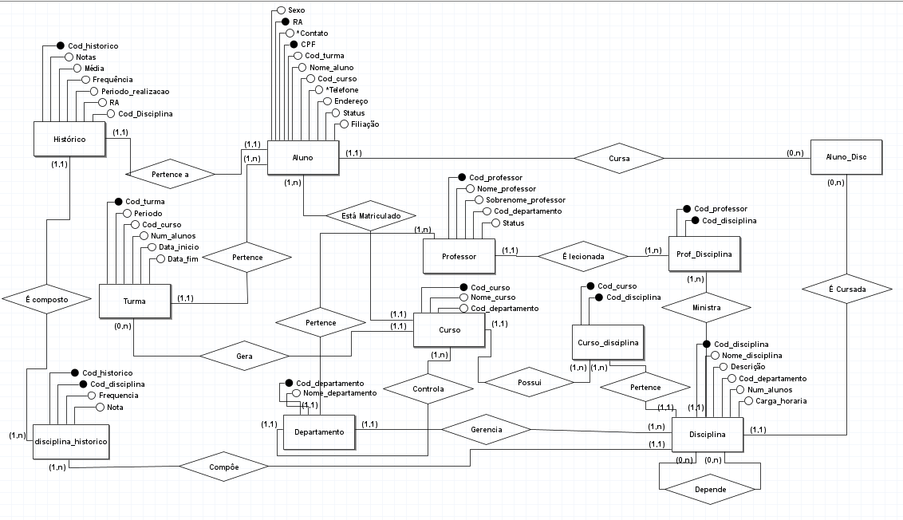
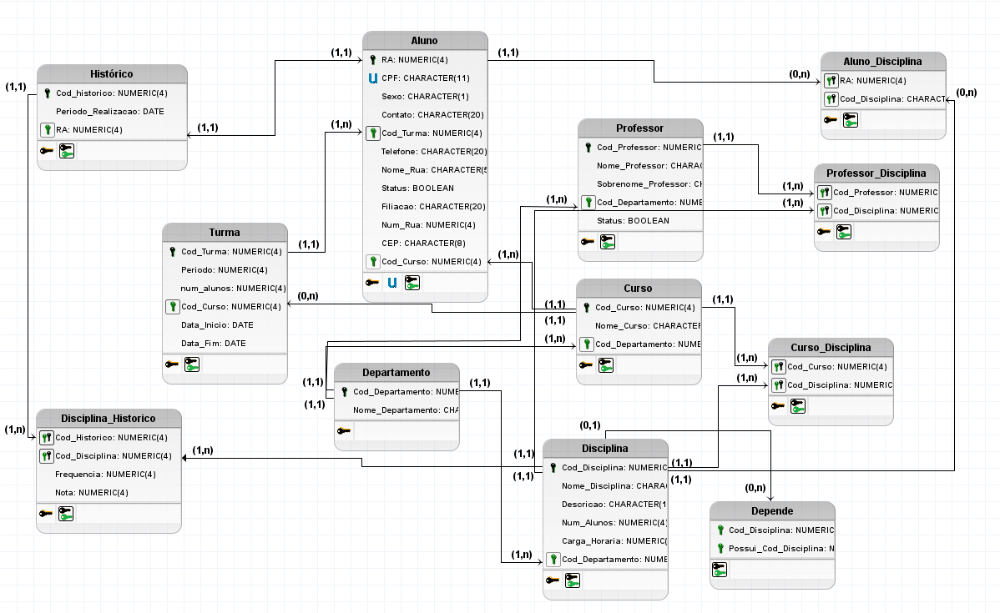

# Diagramação

## Diagrama Entidade-Relacionamento (DER)

### Conceitual

### Lógico

## Diagrama de Casos De Uso

## Diagrama de Classes

# Levantamento de Requisitos

## Requisitos Funcionais

### 1. Gestão de Cadastros Básicos

- RF01 - Manter Departamentos: O sistema deve permitir o cadastro, edição e exclusão de departamentos (Departamento), registrando seu código e nome.

- RF02 - Manter Cursos: O sistema deve permitir o gerenciamento de cursos (Curso), vinculando cada curso a um departamento responsável.

- RF03 - Manter Disciplinas: O sistema deve permitir o cadastro de disciplinas (Disciplina), incluindo nome, descrição, número de alunos (capacidade), carga horária e departamento responsável.

- RF04 - Manter Pré-requisitos: O sistema deve permitir definir se uma disciplina depende de outra(s) para ser cursada (tabela Depende).

- RF05 - Estruturar Grade Curricular: O sistema deve permitir vincular quais disciplinas pertencem a quais cursos (Curso_Disciplina).

### 2. Gestão de Pessoas (Alunos e Professores)

- RF06 - Manter Alunos: O sistema deve permitir o cadastro completo de alunos (Aluno), incluindo RA (Registro Acadêmico), CPF, nome, sexo, filiação e status (ativo/inativo).

- RF07 - Gerenciar Contatos do Aluno: O sistema deve permitir o cadastro de múltiplos telefones para um mesmo aluno (Telefones_Aluno), categorizando-os por tipo (Tipo_Telefone).

- RF08 - Gerenciar Endereço do Aluno: O sistema deve permitir o registro do endereço detalhado do aluno (Endereco_Aluno), incluindo tipo de logradouro (Tipo_Logradouro), rua, número, complemento e CEP.

- RF09 - Manter Professores: O sistema deve permitir o cadastro de professores (Professor), registrando nome, sobrenome, departamento ao qual pertence e seu status.

### 3. Gestão Acadêmica e Alocação

- RF10 - Manter Turmas: O sistema deve permitir a criação de turmas (Turma), vinculando-as a um curso, e definindo período, número de alunos, data de início e data de fim.

- RF11 - Matricular Aluno em Curso e Turma: O sistema deve permitir registrar em qual curso e em qual turma um aluno está matriculado.

- RF12 - Alocar Professor a Disciplina: O sistema deve permitir atribuir quais professores ministram quais disciplinas (Professor_Disciplina).

- RF13 - Matricular Aluno em Disciplina: O sistema deve permitir registrar quais disciplinas um aluno está cursando atualmente (Aluno_Disciplina).

### 4. Gestão de Notas e Histórico

- RF14 - Registrar Notas e Frequência: O sistema deve permitir o lançamento de notas e controle de frequência (faltas/presença) para um aluno em uma disciplina específica (Disciplina_Historico).

- RF15 - Gerar Histórico Escolar: O sistema deve consolidar as informações de notas, frequência e período de realização das disciplinas para gerar o histórico acadêmico do aluno (Histórico).

## Requisitos Não-Funcionais

### 1. Integridade de Dados e Restrições (Evidenciados no Diagrama Lógico)

* RNF01 - Unicidade de Documentos: O CPF do aluno deve ser único no sistema e deve conter exatamente 11 caracteres (marcado como U e CHARACTER(11) no modelo lógico).

* RNF02 - Chaves Primárias: O RA (Registro Acadêmico) deve ser o identificador único e numérico para alunos, assim como os códigos numéricos para Turma, Curso, Professor, Disciplina, etc.

* RNF03 - Formatação de CEP: O CEP registrado nos endereços deve conter exatamente 8 caracteres (CHARACTER(8)).

* RNF04 - Integridade Referencial: O sistema não deve permitir a exclusão de registros que possuam dependências (ex: não excluir um Departamento que possua Cursos vinculados) para manter a consistência das chaves estrangeiras.

2. Arquitetura e Armazenamento

* RNF05 - Banco de Dados Relacional: O sistema deve persistir os dados em um Sistema de Gerenciamento de Banco de Dados (SGBD) relacional, suportando a estrutura normalizada apresentada (tabelas de cardinalidade 1:N e N:M).

3. Segurança e Controle de Acesso (Inferidos pela regra de negócio)

* RNF06 - Controle de Acesso: O sistema deve possuir níveis de permissão distintos. Por exemplo, apenas professores vinculados a uma disciplina (Professor_Disciplina) devem ter permissão para lançar notas e frequência na respectiva matéria (Disciplina_Historico).

* RNF07 - Auditoria Básica: Sendo um sistema acadêmico que lida com histórico e notas, alterações críticas em registros de alunos (como mudança de nota após o fechamento do semestre) devem ser restritas a perfis de coordenadoria/secretaria.

4. Desempenho e Confiabilidade (Inferidos)

* RNF08 - Concorrência: O sistema deve suportar alta concorrência de acessos simultâneos ao banco de dados, especialmente durante os períodos de matrícula em disciplinas (Aluno_Disciplina) e fechamento de notas (Disciplina_Historico).

## Regras de negócio
### 1. Regras de Matrícula e Alocação
   
* RN01 - Controle de Vagas (Lotação): O número de alunos matriculados em uma turma não pode exceder o limite estabelecido no campo num_alunos da tabela Turma.

* RN02 - Validação de Pré-requisitos: Para que um aluno possa cursar uma disciplina, o sistema deve verificar a tabela Depende. O aluno só poderá ser matriculado se já possuir aprovação prévia nas disciplinas listadas como pré-requisito.

* RN03 - Vínculo Obrigatório do Aluno: Todo aluno cadastrado deve estar obrigatoriamente vinculado a um Curso específico (chave estrangeira Cod_Curso obrigatória na tabela Aluno).

* RN04 - Atribuição de Professores: Um professor só pode ser alocado para lecionar em uma turma se ele estiver previamente habilitado para aquela disciplina específica, conforme o cruzamento registrado na tabela Professor_Disciplina.

### 2. Regras de Estrutura Acadêmica
* RN05 - Hierarquia de Departamentos: Um Curso deve pertencer e ser gerido por apenas um único Departamento (cardinalidade 1:1 evidenciada no relacionamento entre Curso e Departamento).

* RN06 - Temporalidade das Turmas: O ciclo de vida de uma turma é estrito. A data de início (Data_Inicio) da Turma deve ser logicamente anterior ou igual à sua data de término (Data_Fim).

* RN07 - Grade Curricular Flexível: Uma disciplina pode ser ofertada para múltiplos cursos diferentes (relacionamento N:M resolvido na tabela Curso_Disciplina), permitindo que matérias como "Cálculo I" sejam compartilhadas entre turmas de Engenharia e Ciência da Computação, por exemplo.

### 3. Regras de Avaliação e Histórico

* RN08 - Fechamento de Notas e Frequência: O lançamento na tabela Disciplina_Historico exige tanto o registro da Nota quanto da Frequência do aluno. Esses dois fatores conjuntos determinarão se o aluno foi aprovado ou reprovado.

* RN09 - Consolidação do Histórico: Um aluno tem apenas um Histórico base (tabela Histórico), que compila o consolidado de todas as matérias já cursadas e finalizadas por ele detalhadas em Disciplina_Historico. Matérias "em curso" (tabela Aluno_Disciplina) não devem constar no histórico final até que a turma seja encerrada.

### 4. Regras de Integridade e Cadastro
   
* RN10 - Unicidade de Cadastro: O sistema não permite a duplicidade de pessoas. O CPF do aluno é um campo único (indicado pela letra U azul no modelo lógico).

* RN11 - Flexibilidade de Contato: O aluno deve ter ao menos um endereço principal (Endereco_Aluno com cardinalidade 1,1) para correspondências legais, mas pode registrar múltiplos telefones (Telefones_Aluno), categorizados de forma padronizada (ex: Celular, Residencial, Recado) através da tabela Tipo_Telefone.

* RN12 - Status de Vínculo: Professores e Alunos possuem um campo Status (tipo booleano). Apenas perfis com status "Ativo" (True) podem ser matriculados em novas turmas ou alocados para lecionar. Registros inativados devem ser mantidos apenas para preservação do histórico.

# Tecnologias